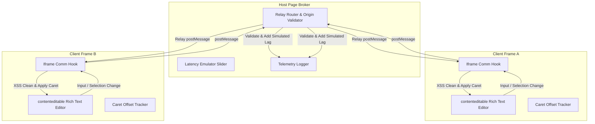

# Bidirectional Inter-Frame Rich Text Synchronization System

A production-grade, secure, real-time bidirectional rich-text editor synchronization system built across two sandboxed `iframe` instances with a host broker.

---

## 1. System Architecture

The application implements a decoupled hub-and-spoke message topology. Each client iframe is fully isolated from its peer and communicates strictly with the `window.parent` host broker.



---

## 2. Folder Structure

```
src/
├── __tests__/           # Vitest Unit Test Suites
│   └── sync.test.ts     # Schema check, sanitizer, and offset mapping tests
├── components/          # React Visual Components
│   ├── ActionLog.tsx    # Live telemetry feed display
│   ├── Editor.tsx       # Contenteditable text area and shortcut hookups
│   ├── EditorFrame.tsx  # Iframe client wrapper layout
│   ├── FrameBroker.tsx  # Host page dashboard and relay orchestrator
│   └── Toolbar.tsx      # Text formatting (Bold/Italic/Strike) & status badges
├── constants/           # Core Configuration Settings
│   └── index.ts         # Timings, origins, frame identities, logs limit
├── hooks/               # Custom Orchestrating Hooks
│   ├── useEditorSync.ts # Coordinates local changes and incoming sync relays
│   ├── useIframeComm.ts # postMessage dispatcher and secure listener
│   └── useRichText.ts   # Toggles format styles & native history undo/redo
├── services/            # Pure Business Services (Browser Abstractions)
│   ├── cursor.ts        # DOM Range to Character offsets mapper (bidirectional)
│   ├── security.ts      # HTML XSS sanitizer & protocol schema validators
│   └── syncProtocol.ts  # Logical clock builders & HTML difference diff check
├── styles/              # Design Tokens
│   └── index.css        # Tailwind CSS import, custom scrollbars, glassmorphism
├── types/               # Type Declarations
│   └── index.ts         # Protocols, states, formatting, telemetry records
├── App.tsx              # URL Mode Switch Router
└── main.tsx             # DOM bootstrapper
```

---

## 3. Setup & Installation

### Prereqs
* Node.js (v18+)
* npm (v9+)

### Installation
1. Clone the project and navigate to the directory:
   ```bash
   cd Educhunks
   ```
2. Install dependencies:
   ```bash
   npm install
   ```
3. Run the development server:
   ```bash
   npm run dev
   ```
4. Access the Host Dashboard at `http://localhost:5173`.

### Production Build & Test
* Run TypeScript type checking:
  ```bash
  npx tsc --noEmit
  ```
* Compile the production bundle:
  ```bash
  npm run build
  ```
* Run the test suite (using Vitest):
  ```bash
  npx vitest run
  ```

---

## 4. Key Design Decisions & Implementation Highlights

### A. Iframe Routing Switcher
Instead of building a complex multi-entry compiler configuration, the app uses **query-parameter routing** in `App.tsx`:
* `http://localhost:5173` renders the **Host Dashboard**.
* `http://localhost:5173?mode=frame&id=frame-a` renders the **Frame A Client**.
* `http://localhost:5173?mode=frame&id=frame-b` renders the **Frame B Client**.
This keeps code unified, deployment simple, and ensures the browsers fully isolate the iframe document scopes.

### B. Logical Clock Versioning
Collaborative editing is prone to race conditions (e.g., out-of-order execution due to network latency).
* Each client maintains a `version` state count.
* When typing/modifying local text, the client increments its version clock.
* Stale incoming messages (`message.version < localVersion`) are discarded immediately.
* The Host dashboard includes a **Lag Simulator (0 - 2000ms)** to let developers simulate high network latency and test logical clock conflict resolutions.

### C. Loop Prevention (Three-Level Guard)
1. **Self-Message Filtering**: The listener discards events where `source === selfId`.
2. **HTML Normalization & Diffing**: Before triggering updates, the target checks incoming HTML equivalence against current text using `normalizeHtml()` (stripping returns, double-spaces, and non-breaking space noise). If equivalent, the sync loop terminates.
3. **Synchronization Lock Mutex**: A local ref flag `isApplyingIncomingSync` locks during DOM modification. Any input/mutation triggers during this frame are silently ignored, preventing ping-pong echo chambers.

### D. Cursor & Caret Offset Preservation
Because synchronizing html completely resets the editor's inner markup, browser cursor ranges are lost.
* **Selection to Offset**: Before broadcasting, the client recursively traverses the DOM text nodes, counting local indices relative to plaintext content up to the selection start/end.
* **Offset to Selection**: After injection, the editor parses the new DOM, locates the target text nodes matching the offsets, and rebuilds the `Range` object.
* **Fallback Caret Recovery**: If offsets exceed boundaries (due to structural modifications), selection safely hooks onto the terminal text node.

---

## 5. Security & Safety Audits

1. **Origin Verification**: All listeners strictly evaluate `event.origin` against the allowed origin whitelist (`ALLOWED_ORIGIN`), discarding unauthorized postMessage sources.
2. **Strict Protocol Guards**: A TypeScript Type Guard (`isSyncMessage`) performs verification checking of all properties (`id`, `source`, `target`, `timestamp`, `version`) before executing callbacks.
3. **XSS Sanitization**: Before HTML is loaded into the editor's DOM, it is passed through `sanitizeHtml()`. This utility parses the string into a temporary DOM tree and recursively strips dangerous tags (`<script>`, `<iframe>`, `<object>`) and scripting attribute event handlers (e.g. `onload`, `onerror`).
4. **Sandboxing**: The Host Dashboard renders both iframes with strict sandboxing policies (`sandbox="allow-scripts allow-same-origin"`), restricting top-level navigations or cross-site escapes.

---

## 6. Future Architectural Roadmap

While `document.execCommand` is suitable for lightweight setups, a production-level enterprise collaborator at a top technology company would scale by:
1. **Migrating to custom DOM models (Lexical / Slate)**: Bypasses browser-specific inconsistencies of `execCommand` and uses standard state schemas.
2. **CRDTs & Operational Transformation (OT)**: Integrating `Yjs` or `Automerge` to transmit character diff operations rather than the entire HTML document body, which solves cursor jumps and structural collisions.
